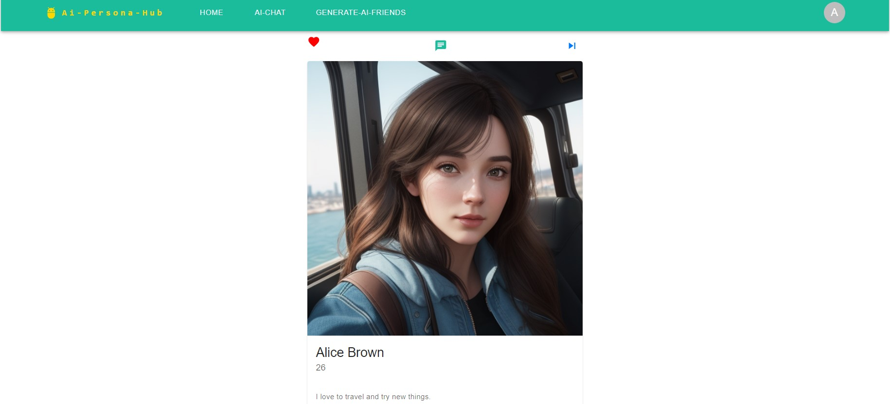
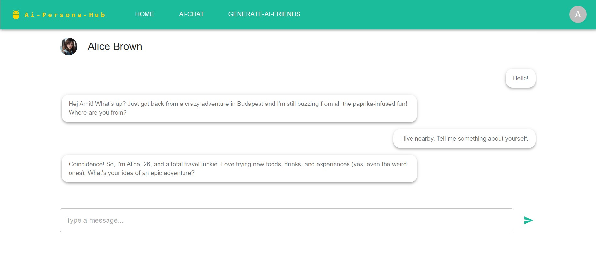
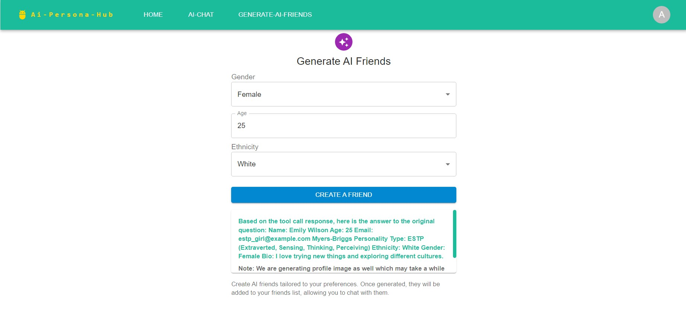
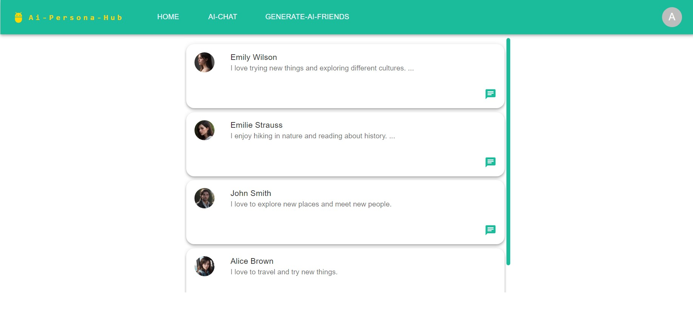

# AI-Persona-Hub

AI-Persona-Hub is a Spring framework based AI project that enables users to create artificial profiles/persona, add them as friends, and 
engage in conversations with them. The entire application is designed to run locally, eliminating the need for any paid 
AI services like ChatGPT. It utilizes Spring-AI to connect with a locally hosted Ollama model.

The code is developed using Java with Spring Boot, Spring WebFlux (for reactive programming), Hibernate, and React.js, and is deployed with Docker using a Microservices Architecture.

## Features:

- **Robust Security**: Users can securely register, log in, and log out with their credentials. The application employs 
Spring Security and Keycloak to implement the OAuth2 Authorization Code flow.

- **AI Profile Management**: Users can create and store AI-generated profiles.

- **AI-Driven Conversations**: Users can chat with AI profiles, with all conversations being stored in the Mongo database. 
The application uses locally hosted open-source Ollama to power these AI interactions.

- **AI Image Creation**: Users can generate and save AI-generated images for profile picture using Stability-AI's Automatic1111,
which runs locally as well without costing you anything.

- **User-Friendly Interface**: The application features an intuitive front end, developed using React.

- **Scalable Microservices Architecture**: The project is designed with a microservices architecture to ensure 
scalability and easy maintenance.

- **Containerized**: Docker-compose file has been provided to quickly start the application.

## Setup and Running on Local
- Download [Ollama](https://ollama.com/) for your OS. Then, go to Models and download **llama3.1** model. We need this so user can chat with AI/bots and to generrate AI profiles. Remember to downnload model which has *Tools* support.
- To generate AI profile images we need a image generation model. We have used [Automatic1111](https://github.com/AUTOMATIC1111/stable-diffusion-webui) for the same. Follow the instruction given on the github page to start stable-diffusion on local. It is recommended to run it on system having NVIDIA GPU.
- We call stable-diffusion's API to generate images from our spring code, so make sure that you start stable diffusion with `--api` command line argument. For windows OS, you can set `COMMANDLINE_ARGS=--api` in `webui-user.bat` file to achieve this.
- Download Docker
- **Keycloak Configuration**
    -  Go to `ai-persona-hub/ai-persona-hub-docker/` and run command `docker compose up -d keycloak`. It will start keycloak on docker.
    - Go to [Keycloak Admin Console](http://localhost:7080/admin/master/console/) and login using admin/admin credentials.
    - Create a new Realm named `ai-persona-hub`
    - Inside this Realm create a new client named `ai-persona-hub-auth-code-grant`. The `Client authentication` should be true and the flow will the `Standard Flow`.
    - Once Client has been created then go to `Credentials` tab and note down `Client secret`. Paste this client secret into file `ai-persona-hub/ai-persona-hub-backend/gateway-server/src/main/resources/application.yaml` in field `client-secret`
    - Go in REALM roles and create a new Role named `AI-PERSONA`
    - Go in Realm settings -> Login Tab then activate User Registration.
    - Go to client `ai-persona-hub-auth-code-grant` ->Client scopes tab-> Select `ai-persona-hub-auth-code-grant-dedicated`->scope tab-> Activate Full scope allowed
    - Navigate to Client Scopes and select the "roles" from list -> Mappers tab->realm roles->Activate Add to ID token
    - Go to Realm settings ->User registration Tab -> Assign Role(AI-PERSONA) which you want user to have whenever a new user registers (It will be visible as inherited roles in user's role mapping tab)
- You need to generate docker images for all spring-boot projects. So, go inside all three folders of `ai-persona-hub/ai-persona-hub-backend` and run `mvn compile jib:dockerBuild` command on each of them.
- Go indside `ai-persona-hub/ai-persona-hub-frontend` and run `docker build --no-cache -t amitking2309/ai-persona-frontend .` command.
- Go to `ai-persona-hub/ai-persona-hub-docker/.env` file and povide the IP address of your local system in environment variable `MACHINE_URL`.
- Go to `ai-persona-hub/ai-persona-hub-docker/` and run command `docker compose up -d`. This will start the application.
- Application will be available on `http://<Your_System's_IPAddress>:8080/`
- Register a new User then login
- Now go to `Generate AI Friend` Menu and create a new AI Profile of your choice.
- You can create as many AI profiles as you want. These profiles will be visible on Home Tab. You can add a profile as favourite and it will be visible to you in `AI-Chat` tab.
- You can chat with any AI Profile by clicking on chat widget button.